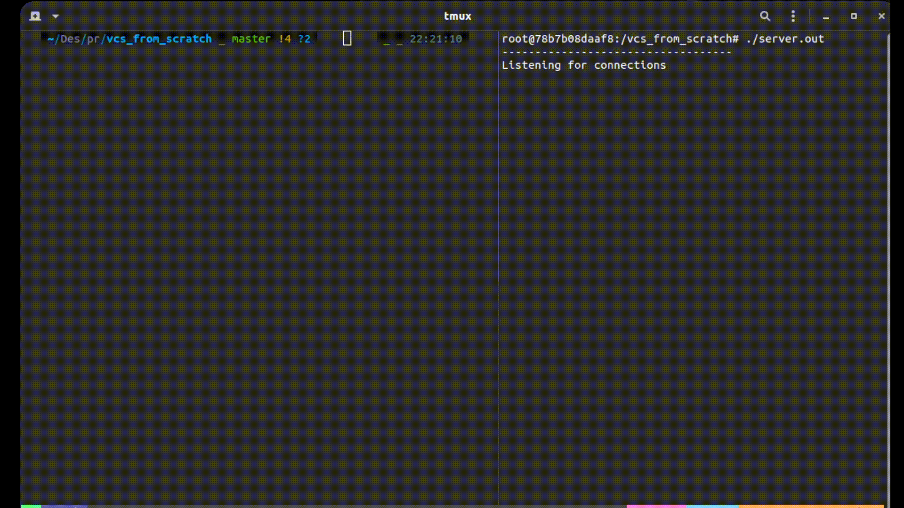

# VCS-from-scratch

## Table of Contents

- [About](#about)
- [Getting Started](#getting_started)
- [Usage](#usage)
- [TODO](#todo)
- [Future Scopes](#future)

## About <a name = "about"></a>

This is my attempt at creating a version control similar to git and is still currently in development, created from scratch in C++. Features functionalities like status, commit, push and log.   
NOTE: This will work only on Linux and Unix systems and does not support Windows for now. This uses the C++17 standard.

## Demo: 

## Getting Started <a name = "getting_started"></a>

Clone the repository
```
https://github.com/shadyskies/vcs_from_scratch.git
```


### Prerequisites

Sqlite3, g++-9 should be installed.

### Installing

Build the main file.

```
g++ -std=c++17 client.cpp file.cpp -lsqlite3 -o file.out
```

And on the remote server.

```
g++ -std=c++17 server.cpp -o server.out
```
Change the host IP in server.cpp to match server IP.

## Usage <a name = "usage"></a>

Run commands as you normally would with git.
```
./file.out < status / commit <message> / push(requires server to be running) / log >
```

Run the server(Tested on docker container)
```
./server.out 
```

## TODO <a name = "todo"></a>: 
 - ~~figure out database~~ 
 - ~~figure out files diff~~
 - ~~diff code for remote vs local~~
 - ~~test in docker~~
 - ~~garbage values in end of file (check bytes written)~~
 - ~~diff bw server and client~~ 
 - ~~listen for incoming connections after one client closes~~
 - add commit hash
 - where does HEAD for local point wrt remote?
 - multiple clients? (data inconsistency)
 - package code

 ## Future Scopes  <a name = "future"></a>:
 - Branching
 - Revert Commit
 - Cherry Pick
 - Merge